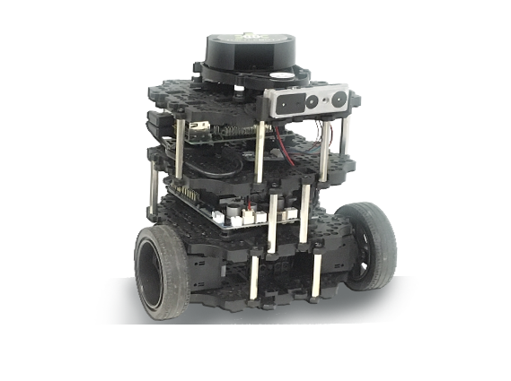
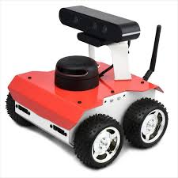
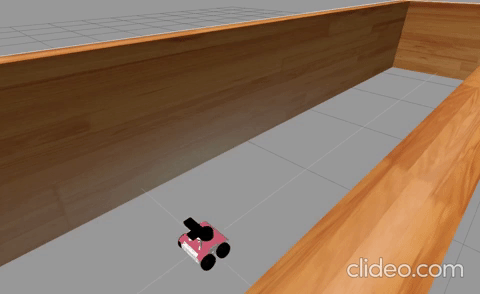
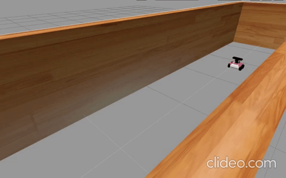
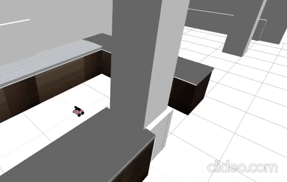
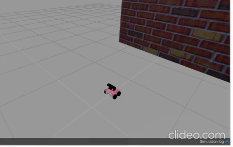

# C++ for Robotics Course - Completed! 🤖


## 📚 Course Overview

Successfully completed the **"C++ for Robotics"** course from **The Construct**! This course focused on programming real robots using C++ and ROS (Robot Operating System).

<div align="center">


</div>

## 🤖 What I learned

### 🏃‍♂️ **Robot Movement & Speed Control**   




---

### 🔄 **Automated Movement Patterns** 




---

### 🧭 **Autonomous Navigation System**


---

### �️ **Laser Sensor Integration**



---

### 🧠 **Advanced Autonomous Behavior**



## 🛠️ Technologies I Used

- **Language**: C++
- **Framework**: ROS (Robot Operating System)
- **Robots**: ROSbot 2.0 & TurtleBot3
- **Simulator**: Gazebo
- **Platform**: The Construct IDE

## 🏆 What I Achieved

✅ **Completed all 6 course units**  
✅ **Built working robot programs**  
✅ **Created autonomous navigation systems**  

## 📁 Project Structure

```
CPP_Robotics_/
├── 📄 README.md                 # You are here!
├── 🖼️ assets/                   # All the cool images
└── 💻 src/                      # My C++ solutions
```
---

<div align="center">

**🤖 Course**: C++ for Robotics  
**🏫 Provider**: [The Construct](https://www.theconstruct.ai/)  
</div>

---

